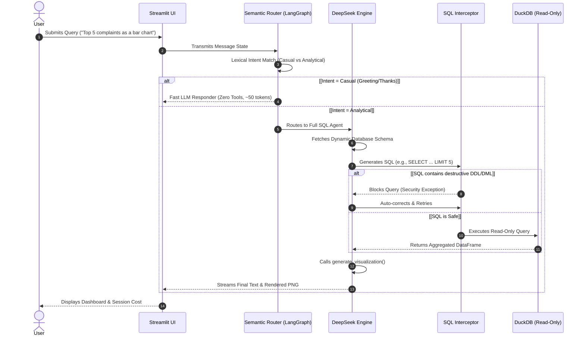

<div align="center">
  
# 🗽 NYC 311 Enterprise Data Agent

**Enterprise-Grade AI Analytics Orchestration & Visualization Engine**

<p align="center">
  
  
  
  
  
  
  
</p>

</div>

---

## 🎯 The "Why": Problem & Solution

**The Problem**  
Analyzing massive municipal datasets like the NYC 311 Service Requests (millions of rows) is traditionally a slow, fragmented process. It requires data engineers to write complex SQL, configure BI dashboards, and maintain brittle data pipelines. Loading these datasets into memory using standard Pandas pipelines inevitably leads to Out-Of-Memory (OOM) crashes on standard machines. Furthermore, standard LLMs hallucinate SQL syntax when attempting to query massive tables directly.

**The Solution**  
The **NYC 311 Enterprise Data Agent** is a high-security, autonomous automation layer built on LangGraph and DuckDB. It enforces a zero-trust semantic routing policy. When a data query is detected, the agent bypasses standard memory limitations by compiling the natural language into highly optimized DuckDB OLAP queries, securely executing them via an internal firewall, and dynamically rendering presentation-ready Seaborn visualizations.

### Business Impact
- **Zero Technical Overhead**: Replaces hours of manual SQL cross-referencing and dashboard building with a millisecond-latency NLP pipeline.
- **Maximum Resource Efficiency**: By natively querying a highly compressed DuckDB OLAP file, it eliminates memory bottlenecks, recovering gigabytes of RAM while querying millions of rows instantly.
- **High-Fidelity Insights**: Guarantees deterministic, hallucination-free data aggregation by forcing the LLM to route all math and logic through the DuckDB engine natively.

---

## ⚙️ Complex Mechanism: The Semantic SQL Orchestration Protocol

Standard Text-to-SQL agents struggle with syntax hallucinations, prompt-injection, and destructive DML commands (`DROP`, `DELETE`). The NYC 311 Agent handles this via a multi-tiered Semantic Router, Regex-based SQL Firewalls, and Read-Only Driver Isolation.



---

## 🚀 Setup & Installation

### Option 1: Docker (Recommended)
Deploy instantly using the pre-configured Docker image.
```bash
git clone <your-repo-url>
cd nyc-311-agent

# Build and start the container
docker build -t nyc-311-agent .
docker run -p 8501:8501 --env-file .env nyc-311-agent
```

### Option 2: Python Virtual Environment
```bash
python -m venv venv

# Windows
.\venv\Scripts\Activate.ps1
# Linux/macOS
source venv/bin/activate

pip install -r requirements.txt
```

### Configuration & Data Ingestion
1. Copy the environment template:
   ```bash
   cp .env.example .env
   # Open .env and set DEEPSEEK_API_KEY
   # Optional: Set LANGCHAIN_API_KEY for LangSmith tracing
   ```
2. Download the Dataset from [Kaggle](https://www.kaggle.com/datasets/pablomonleon/311-service-requests-nyc?resource=download) (extract `311_Service_Requests_from_2010_to_Present.csv`).
3. Place the CSV in the `data/` folder and run the pipeline:
   ```bash
   python scripts/ingest.py
   ```
4. Start the application natively:
   ```bash
   .\run.ps1
   ```

---

## 🗂️ Project Structure

```text
.
├── .dockerignore
├── .env.example
├── Dockerfile                  # Enterprise container configuration
├── README.md
├── requirements.txt            # Pinned dependencies (LangChain, Streamlit, DuckDB)
├── run.bat                     # Windows startup script
├── run.ps1                     # Windows PowerShell startup script
├── data/
│   └── nyc_311.duckdb          # Highly compressed OLAP database (Generated)
├── scripts/
│   ├── ingest.py               # CSV chunking and timestamp parsing pipeline
│   └── test_models.py          # Script for debugging models
├── src/
│   ├── agent.py                # LangGraph architecture & semantic routing
│   ├── app.py                  # Streamlit frontend & session state management
│   └── tools.py                # Protected SQL tools & Seaborn visualization
├── outputs/                    # Cached chart artifacts (PNGs)
└── logs/
    ├── app.log                 # Core system telemetry
    └── sessions/               # Persistent JSON chat histories
```
