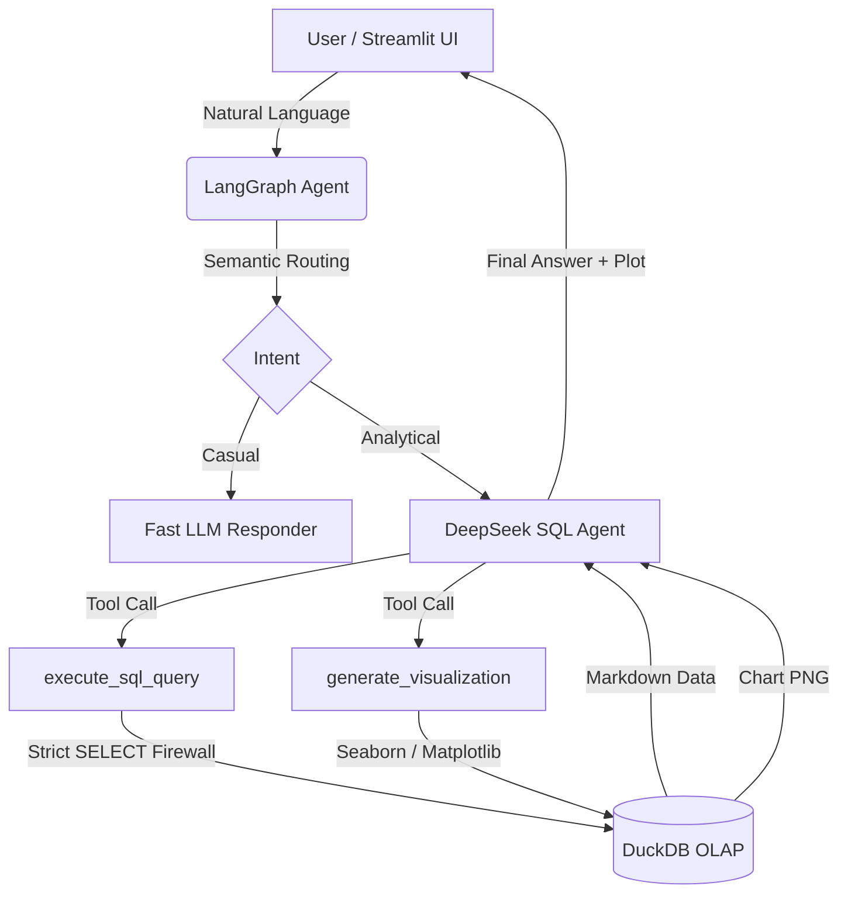

<div align="center">
  
# 🗽 NYC 311 Enterprise Data Agent

**Enterprise-Grade AI Analytics Orchestration & Visualization Engine**

<p align="center">
  
  
  
  
  
  
</p>

</div>

---

## 🎯 The "Why": Problem & Solution

**The Problem**  
Analyzing massive municipal datasets like the NYC 311 Service Requests (millions of rows) is traditionally a slow, fragmented process. It requires data engineers to write complex SQL, configure BI dashboards, and maintain brittle data pipelines. For non-technical stakeholders, getting a simple answer like *"What is the average resolution time for noise complaints?"* takes days of turnaround time. Furthermore, loading these datasets into memory using standard Pandas pipelines often leads to Out-Of-Memory (OOM) crashes on standard machines.

**The Solution**  
The **NYC 311 Enterprise Data Agent** is a state-of-the-art conversational analytics platform. It replaces manual dashboarding with an autonomous AI agent capable of translating natural language directly into highly optimized DuckDB SQL. By leveraging a zero-trust SQL firewall, in-process columnar execution, and dynamic Matplotlib/Seaborn rendering, the agent provides instant, production-grade insights without the overhead.

### 💼 Business Impact
- **Zero Technical Overhead**: Replaces hours of manual SQL cross-referencing and dashboard building with a millisecond-latency NLP pipeline.
- **Maximum Resource Efficiency**: By natively querying a highly compressed DuckDB OLAP file, it eliminates memory bottlenecks, querying millions of rows instantly on standard hardware.
- **High-Fidelity Insights**: Automatically generates and archives dynamic charts (pie, bar, line, scatter) tailored to the exact analytical request, delivering presentation-ready visualisations instantly.

---

## 🗃️ Dataset Source (Kaggle)

This project is built to analyze the official NYC 311 Service Requests dataset.  
**Download the dataset here:** [NYC 311 Service Requests on Kaggle](https://www.kaggle.com/datasets/pablomonleon/311-service-requests-nyc?resource=download)

*(Note: You only need to download the `311_Service_Requests_from_2010_to_Present.csv` file)*

---

## 🏗️ Architecture & Data Flow



## 🔒 Security Model

The system implements a rigorous dual-layer security architecture:
1. **Application-Level Firewall**: A custom regex interceptor explicitly blocks destructive DDL/DML (e.g., `DROP`, `DELETE`, `UPDATE`, `COPY`, `ATTACH`) before they reach the engine.
2. **Database-Level Isolation**: DuckDB is mounted strictly in `read_only=True` mode on the python driver, ensuring absolute data immutability.

---

## 🚀 Setup & Installation

### 1. Prerequisites
- Python 3.11 or higher
- [DeepSeek API Key](https://platform.deepseek.com/)

### 2. Environment Setup
Clone the repository and initialize an isolated virtual environment:

```bash
git clone <your-repo-url>
cd nyc-311-agent

# Create virtual environment
python -m venv venv

# Windows
.\venv\Scripts\Activate.ps1
# Linux/macOS
source venv/bin/activate

# Install dependencies
pip install -r requirements.txt
```

### 3. Configuration
Copy the environment template and securely add your API key:
```bash
cp .env.example .env
# Open .env and set DEEPSEEK_API_KEY=your_key_here
```

### 4. Data Ingestion
1. Download the CSV from the [Kaggle link above](#%EF%B8%8F-dataset-source-kaggle).
2. Place `311_Service_Requests_from_2010_to_Present.csv` in the `data/` folder.
3. Run the ingestion pipeline to compile the highly compressed `.duckdb` OLAP file:
```bash
python scripts/ingest.py
```

### 5. Start the Application
Start the premium Streamlit server:
```bash
# Windows
.\run.ps1
# Linux/macOS
streamlit run src/app.py
```
The application will be available locally at `http://localhost:8501`.

---

## 💡 Example Queries to Try

Once the server is running, try asking the agent these questions to see it orchestrate SQL execution and charting dynamically:

- *"What are the top 10 complaint types by total volume? Present it as a horizontal bar chart."*
- *"Which ZIP code has the highest number of complaints?"*
- *"For the top 5 complaint types, what percentage were closed within 3 days?"*
- *"What is the average resolution time in days for noise complaints by borough?"*
